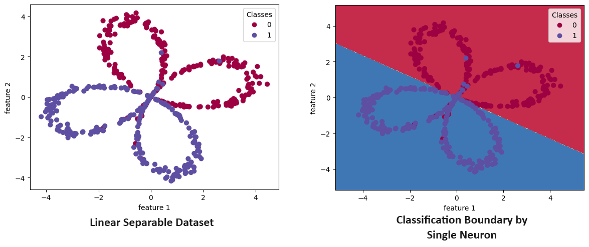

# p001-single-neuron-scratch
 Binary classification by single vanilla neuron(logistic regression inspired). Neuron is implemented using python without frameworks. For detailed tutorial, [visit my notes](https://spicy-piranha-7fc.notion.site/Single-Neuron-from-Scratch-509cab06175948d193a16a0736e6bd1d?pvs=4).
  
  
 File [neuron_understanding.ipynb](neuron_understanding.ipynb) contains markdown notes for better understanding; and neuron working functions are defined within notebook. It is less polished but more intuitive for understanding neuron code.
   
 Moving on, two synthetic datasets are used, i.e. linear and non-linear separable flower petals, in [neuron_and_linear_separable_data.ipynb](neuron_and_non-linear_separable_data.ipynb) and [neuron_and_non-linear_separable_data.ipynb](neuron_and_non-linear_separable_data.ipynb) notebooks, respectively. For polished code, functions used these in two notebooks are contained in file [single_neuron_scratch_functions.py](single_neuron_scratch_functions.py). 
  
 
  
 
